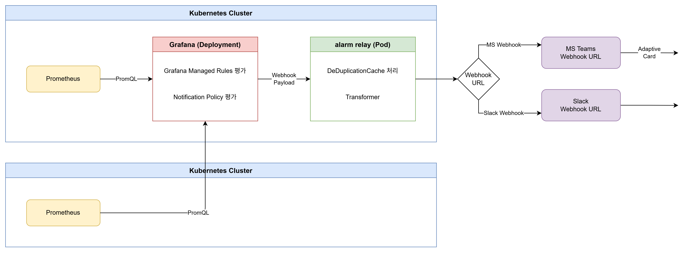

# Observability System

- kube-prometheus-stack 기반 Kubernetes 클러스터 모니터링 및 알람 기능 구현에 사용한 코드
- 멀티 클러스터 환경에 사용할 수 있는 구조를 테스트하기 위한 목적으로 사용
- 이상 감지 시 MS Teams or Slack을 선택 적으로 전달할 수 있도록 구성

## 전체 아키텍처

## 서브 프로젝트

### [01-alarm](./01-alarm) — 알람 중계 서버

Grafana에서 자체 지원되지 않는 두 가지 기능을 처리하기 위해 만든 Python 서버로 Grafana Webhook을 수신하여 MS Teams / Slack으로 전달

- **Adaptive Card 포맷**: severity 색상, 대시보드/무음 처리 버튼, 구조화된 알람 정보
- **다단계 임계값 구분**: CPU 70/80/90% 처럼 여러 band가 있을 때 resolved 메시지가 에스컬레이션인지 완전 해소인지 판단

### [02-kube-prometheus-stack](./02-kube-prometheus-stack) — 모니터링 스택

kube-prometheus-stack 기반 Helm 차트입니다. 수집·저장·시각화·알람 규칙을 모두 포함 

- **멀티 클러스터**: 1st는 Grafana+Prometheus 풀셋, 2nd는 Prometheus만 배포 후 원격 datasource로 연결
- **설정 코드화**: Alert Rules·Datasources·Dashboards·Contact POoints를 모두 ConfigMap으로 관리 (Grafana UI 의존 없음)
- **알람 룰 25개**: Pod / Node / Storage 3개 카테고리, 70/80/90% 3단계 임계값

| 항목      | 내용                                                                |
| --------- | ------------------------------------------------------------------- |
| 스택      | kube-prometheus-stack v78.3.0 (Prometheus v3.6.0 / Grafana v12.2.0) |
| 알람 방식 | Grafana Managed Rules (Alertmanager 미사용)                         |
| 배포      | Helm, 클러스터별 values 파일 분리                                   |

## 커스텀 대시보드

| 대시보드                            | 설명                                                                  |
| ----------------------------------- | --------------------------------------------------------------------- |
| **cluster-core-resource-status**    | 클러스터 전체 노드·Pod 리소스 현황 (CPU·Memory·Disk·Network·Pod 상태) |
| **pod-resource-usage-by-namespace** | 네임스페이스별 Pod CPU·Memory·PVC·Network 상세 분석                   |

---

## 알람 룰 목록

| 카테고리 | Alert Name                          |           Severity           |
| :------: | ----------------------------------- | :--------------------------: |
|   Pod    | PodPendingTooLong                   |           WARNING            |
|   Pod    | PodCrashLoopBackOff                 |           CRITICAL           |
|   Pod    | PodOOMKilled                        |           CRITICAL           |
|   Pod    | PodCPUUsageHigh70 / 80 / 90         |  INFO / WARNING / CRITICAL   |
|   Pod    | PodMemoryUsageHigh70 / 80 / 90      |  INFO / WARNING / CRITICAL   |
|   Node   | NodeNotReady                        |           CRITICAL           |
|   Node   | NodeCPUUsageHigh70 / 80 / 90        | WARNING / WARNING / CRITICAL |
|   Node   | NodeMemoryUsageHigh70 / 80 / 90     | WARNING / WARNING / CRITICAL |
|   Node   | NodeFilesystemUsageHigh70 / 80 / 90 | WARNING / WARNING / CRITICAL |
| Storage  | NFSMountReadOnly                    |           CRITICAL           |
| Storage  | PVCNotBound                         |           WARNING            |
| Storage  | PVCUsageHigh70 / 80 / 90            | WARNING / WARNING / CRITICAL |
